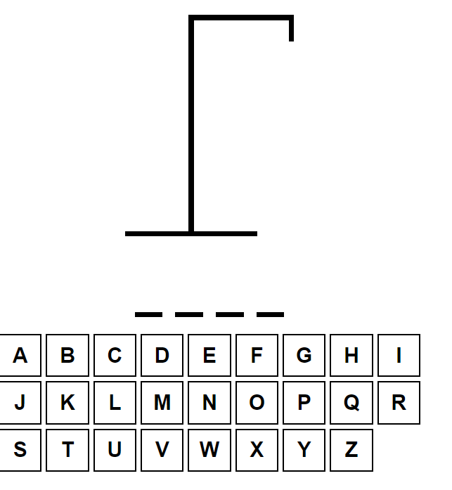
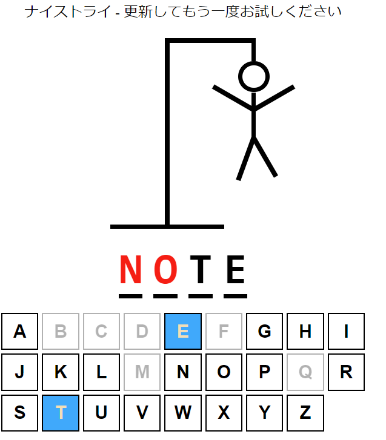
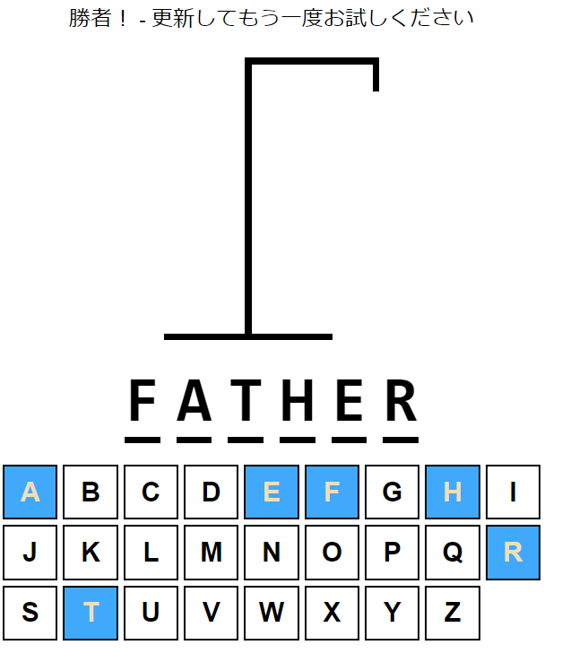
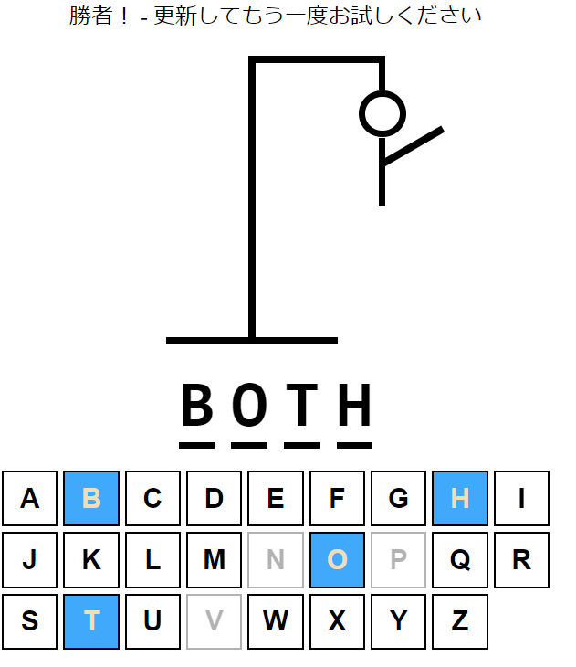

# Vite_Hangman
これはReactJSを学ぶために作られたゲーム「ハングマン」です。

1. 1人のプレイヤーが単語やフレーズを考え、その単語の各文字に対して空白の線を引きます。
2. 他のプレイヤーは文字を提案して単語を推測しようとします。
3. 文字が正しければ、その文字が空白に埋められます。
4. 文字が間違っている場合、絞首台にハングマンの一部が描かれます。
5. 単語が推測される前にハングマンの図が完成すると、プレイヤーは負けます。
----------------------------------------------------------------------------------------------
1. One player thinks of a word or phrase and draws a blank line for each letter in the word.
2. The other player(s) try to guess the word by suggesting letters.
3. If a letter is correct, it is filled in the blanks.
4. If a letter is wrong, a part of the hangman figure is drawn on the gallows.
5. The player(s) lose if the hangman figure is completed before the word is guessed.

  

  

  

  

